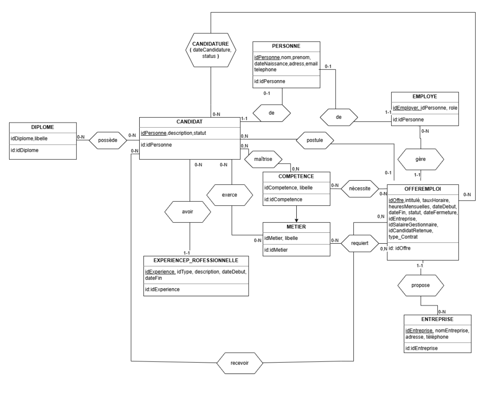
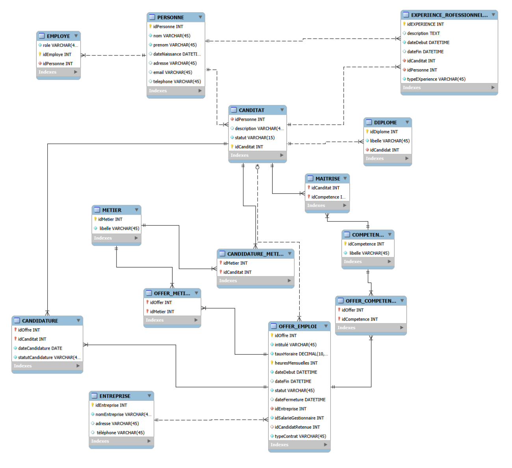

[Français](README.md) | English

# Database for a Temporary Staffing Agency - MySQL

Relational database designed to support the core activities of a temporary staffing agency: management of people and candidates, companies, job offers, applications, occupations, skills, degrees, and professional experience.

This repository presents a university team project as a concise technical portfolio. It contains the data model, executable MySQL scripts, representative business queries, and database-level automation. The course instructions and the full university report are intentionally excluded.

## Business Context

The agency needs a consistent data model to:

- manage employees, candidates, and client companies;
- publish and track job offers and applications;
- link candidates and offers through occupations and skills;
- record the selected candidate for a filled offer;
- analyze placements, commissions, and employee performance;
- enforce recruitment and data-retention rules directly at the database level.

All names, contact details, companies, and operational records in the sample data are fictitious.

## Database Design

The implementation contains 14 tables. The main entities, notably `PERSONNE`, `CANDIDAT`, `EMPLOYE`, `ENTREPRISE`, and `OFFRE_EMPLOI`, are separated from association (junction) tables such as `CANDIDATURE`, `MAITRISE`, `CANDIDAT_METIER`, `OFFRE_METIER`, and `OFFRE_COMPETENCE`.

The model is normalized to third normal form (3NF): attributes are atomic, many-to-many relationships are represented by junction tables with composite keys, and each piece of descriptive information is stored with the entity it depends on. Foreign keys, `CHECK` constraints, and indexes enforce referential integrity and domain validation.

### Conceptual Data Model



### Relational Data Model



The editable MySQL Workbench file is available at [`schema/source-model.mwb`](schema/source-model.mwb).

## Main SQL Use Cases

The query file translates several operational questions into SQL:

- list applications with the candidate, the offer, and the company;
- analyze applications by candidate and by offer;
- calculate the agency's monthly commission and the number of filled positions;
- calculate commissions and placements per recruiting employee;
- identify, using a `LEFT JOIN`, skills with no associated candidate;
- match an open offer with available candidates who share an occupation or a skill, excluding those who have already applied;
- create pending applications from the matching view;
- close an offer, record the selected candidate, and update the application statuses.

Candidate matching combines a view, `UNION`, several joins, `DISTINCT`, and a subquery. It is deterministic, rule-based logic driven by business rules, not an AI recommendation system.

## Views, Triggers, and Stored Procedures

`03_business_queries.sql` creates `V_CANDIDATS_POTENTIELS`, a reusable view for identifying potential candidates.

`04_business_rules.sql` implements seven triggers and two stored procedures. These rules notably make it possible to:

- block the physical deletion of offers;
- automatically record the closing date of an offer;
- preserve recruitment history by anonymizing a candidate;
- prevent the assignment of a candidate who is already under an active contract;
- prevent the reassignment of an offer that has already been filled;
- restore availability after a contract ends;
- enforce a minimum age of 16 when a candidate registers.

The same script also contains commented failure cases and successful validation examples.

## Repository Structure

```text
recruitment-agency-database/
├── README.md
├── README.en.md
├── schema/
│   ├── conceptual-model.png
│   ├── relational-model.png
│   └── source-model.mwb
└── sql/
    ├── 01_schema.sql
    ├── 02_sample_data.sql
    ├── 03_business_queries.sql
    └── 04_business_rules.sql
```

## Running Locally

Prerequisites: MySQL 8.0+ and, optionally, MySQL Workbench.

Run the scripts in numerical order:

```bash
mysql -u <utilisateur> -p < sql/01_schema.sql
mysql -u <utilisateur> -p < sql/02_sample_data.sql
mysql -u <utilisateur> -p < sql/03_business_queries.sql
mysql -u <utilisateur> -p < sql/04_business_rules.sql
```

The scripts recreate and use a schema named `recruitment_agency`. The first script drops this schema if it already exists, so use a dedicated local instance for testing.

## Technologies and Methods

MySQL 8.0+, MySQL Workbench, SQL, relational modeling, MCD/MLD (conceptual and logical data models), normalization to 3NF, joins, aggregations, subqueries, views, triggers, stored procedures, constraints, and indexes.

## Project Attribution

This work was completed as part of a university project carried out by a two-person team. Modeling, SQL queries, views, triggers, stored procedures, testing, and reviews were shared within the team. This repository reorganizes the existing technical work for presentation in a portfolio; it does not claim individual authorship of the entire project.
